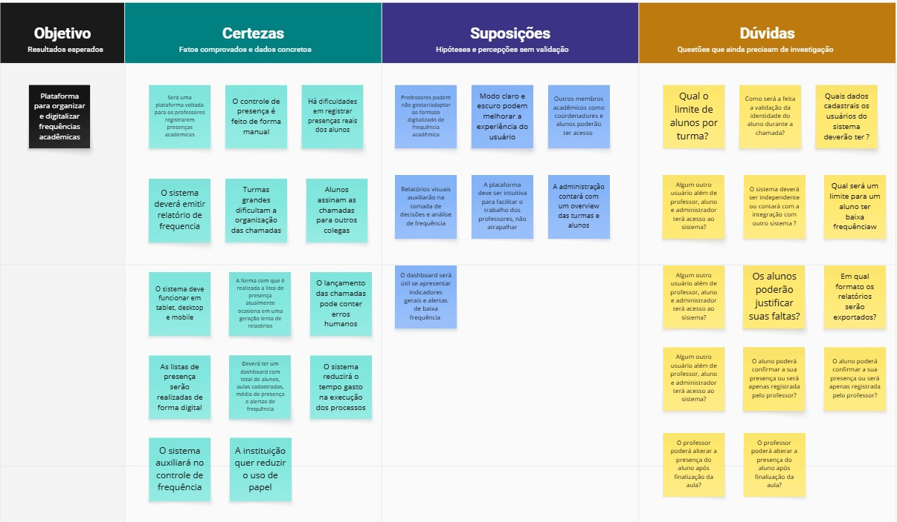

# Boas Práticas do Repositório

Esta seção reúne orientações para manter o repositório do projeto **Desafio 4** organizado, padronizado e fácil de utilizar por todos os integrantes da equipe.

## Objetivo

O objetivo desta seção é orientar a equipe sobre:

- Como organizar os arquivos dentro do repositório;
- Como contribuir sem sobrescrever o trabalho de outros integrantes;
- Como seguir os padrões definidos para branches e commits;
- Como manter a documentação consistente no MkDocs;
- Como evitar erros comuns durante o uso do GitHub.

## Conteúdo da seção

| Página | Descrição |
|---|---|
| [Padrão de Branches](padrao_branch.md) | Define como as branches devem ser nomeadas e utilizadas no projeto. |
| [Padrão de Commits](padrao_commit.md) | Define o formato recomendado para mensagens de commit. |

## Estrutura da documentação

A documentação principal do projeto está dentro da pasta `docs/`.

```txt
docs/
├── arquitetura/
├── backlog/
├── boas_praticas/
├── planejamento/
├── visao/
├── setup_tecnico.md
└── index.md
```

A pasta `boas_praticas/` concentra orientações de uso do repositório e padrões de colaboração da equipe.

```txt
docs/boas_praticas/
├── index.md
├── padrao_branch.md
└── padrao_commit.md
```


## Fluxo recomendado de trabalho

Antes de alterar qualquer arquivo, recomenda-se seguir o seguinte fluxo:

```txt
1. Atualizar o repositório local
2. Criar uma branch para a tarefa
3. Editar os arquivos necessários
4. Verificar as alterações feitas
5. Criar um commit seguindo o padrão definido
6. Enviar a branch para o GitHub
7. Abrir um Pull Request
8. Aguardar revisão da equipe
9. Realizar o merge após aprovação
```

## Antes de editar

Antes de começar uma alteração, atualize o repositório local:

```bash
git pull
```

Isso reduz a chance de conflitos com alterações feitas por outros integrantes.

## Durante a edição

Ao editar os arquivos, siga estas orientações:

- Edite apenas os arquivos relacionados à sua tarefa;
- Evite modificar arquivos de responsabilidade de outro integrante sem avisar;
- Não apague arquivos sem consultar a equipe;
- Não crie arquivos duplicados para o mesmo conteúdo;
- Use nomes de arquivos simples, sem espaços e sem acentos;
- Confira se os links internos continuam funcionando após mover ou renomear arquivos.

## Organização dos arquivos

Use nomes de arquivos em letras minúsculas e com underline.

Exemplos recomendados:

```txt
historias_usuario.md
perfil_personas.md
cenario_atual.md
solucao_proposta.md
integracao_front_back.md
```

Evite nomes como:

```txt
Histórias de usuário.md
arquivo final.md
versão nova.md
teste certo.md
```

## Arquivos de imagem e anexos

Imagens, diagramas e arquivos auxiliares devem ser organizados em uma pasta própria, como:

```txt
docs/assets/images/
```

Ao inserir imagens em arquivos Markdown, use uma descrição clara:

```md

```

Ajuste o caminho conforme a localização do arquivo onde a imagem será utilizada.

## Conferindo o site localmente

Para visualizar o site antes de enviar alterações para o GitHub:

```bash
mkdocs serve
```

Depois, acesse no navegador:

```txt
http://127.0.0.1:8000/
```

## Cuidados com o `mkdocs.yml`

O arquivo `mkdocs.yml` controla a navegação do site.

Por isso, ele deve ser alterado com cuidado. Um caminho errado pode fazer uma página não aparecer no site ou quebrar a navegação.

Antes de modificar o `mkdocs.yml`, confira se:

- O arquivo mencionado realmente existe;
- O caminho está correto;
- O nome usado no menu está claro;
- A página abre corretamente no site local.

## Em caso de conflito

Conflitos podem acontecer quando duas pessoas alteram o mesmo trecho de um arquivo.

Caso apareça um conflito, não apague conteúdo sem entender o que está acontecendo. Avise a equipe e peça ajuda antes de sobrescrever alterações.

