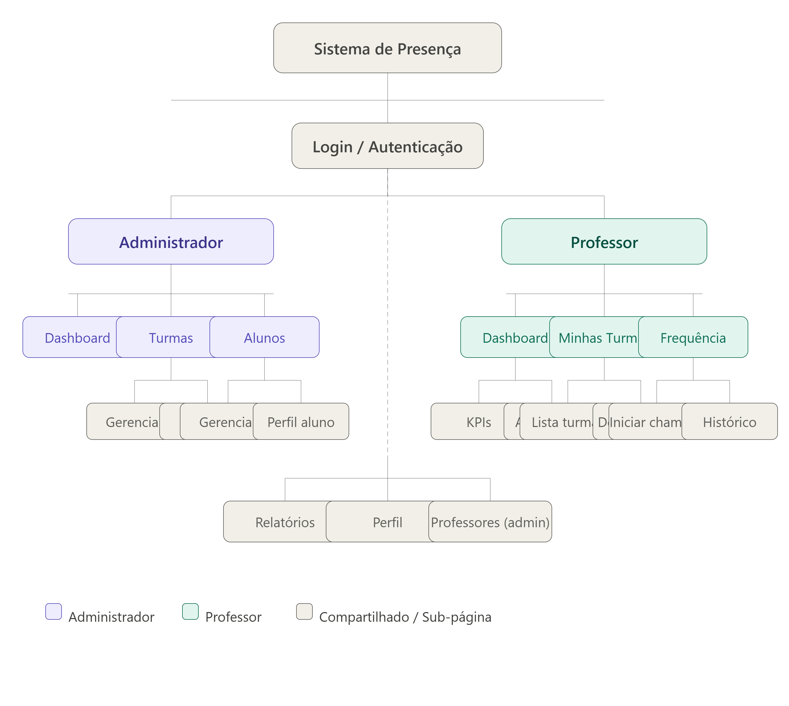
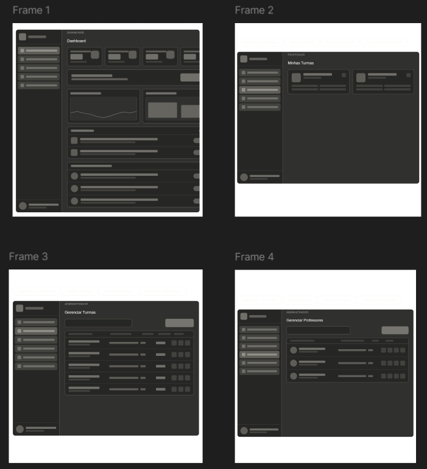
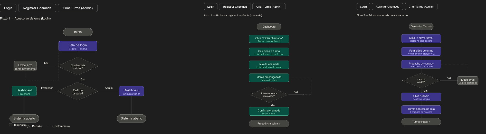

# Sitemap, Wireframe e User Flow

## Introdução

Durante a etapa de prototipação do Sistema de Controle de Frequência Acadêmica foram desenvolvidos três artefatos de UX/UI fundamentais para o planejamento da navegação e da experiência do usuário: **Sitemap**, **Wireframe** e **User Flow**.

Esses artefatos permitiram estruturar a arquitetura da informação do sistema, definir a organização das telas e mapear os principais fluxos de interação dos usuários, servindo como base para o desenvolvimento da solução.

---

## 1. Sitemap

O Sitemap foi elaborado para representar a estrutura hierárquica do sistema e a relação entre suas páginas e funcionalidades. Através dele foi possível visualizar a organização do sistema de acordo com os perfis de acesso existentes, facilitando a definição da navegação e da arquitetura da informação.

A estrutura foi dividida entre os perfis de **Administrador** e **Professor**, contendo as respectivas funcionalidades disponíveis para cada tipo de usuário, além das páginas compartilhadas.

### Figura 1 – Sitemap do ClassHub

O mapa evidencia a separação das responsabilidades entre os perfis de usuário e demonstra como as funcionalidades estão organizadas dentro do sistema.

---

## 2. Wireframe

Os wireframes foram desenvolvidos para definir a estrutura visual das telas antes da implementação da interface final. Nessa etapa foram estabelecidos os principais componentes de navegação, distribuição de conteúdo e organização dos elementos da interface.

As telas contemplam funcionalidades como dashboard, gerenciamento de turmas, gerenciamento de professores e visualização das turmas do docente, permitindo validar a experiência do usuário e a disposição das informações antes do desenvolvimento.

### Figura 2 – Wireframes do ClassHub

Os wireframes serviram como base para a prototipação da interface, auxiliando na padronização dos componentes visuais e na definição do fluxo de navegação entre as telas.

---

## 3. User Flow

O User Flow foi elaborado para representar o caminho percorrido pelos usuários durante a execução das principais tarefas do sistema. Os fluxos demonstram as ações realizadas, os pontos de decisão e os possíveis resultados de cada processo.

Foram mapeados os seguintes cenários principais:

* Acesso ao sistema por meio de autenticação;
* Registro de frequência realizado pelo professor;
* Criação de turmas realizada pelo administrador.

### Figura 3 – User Flow do Sistema

A modelagem dos fluxos permitiu validar a lógica de navegação do sistema, identificar possíveis pontos de erro e garantir que as funcionalidades fossem executadas de maneira intuitiva pelos usuários.

---

## Histórico de Versão

| Versão | Data | Descrição | Autor |
| ------ | ---- | ------------------------------------------------------------------------------------- | ----------------- |
| 1.0 | 15/06/2026 | Elaboração dos artefatos de UX/UI para o Sistema de Controle de Frequência Acadêmica. | Beatriz |
| 1.1 | 15/06/2026 |  Ajustes finais de conteúdo, revisão textual e adequação para entrega da documentação do projeto. | [Camila Silva](https://github.com/CamilaSilvaC) |
